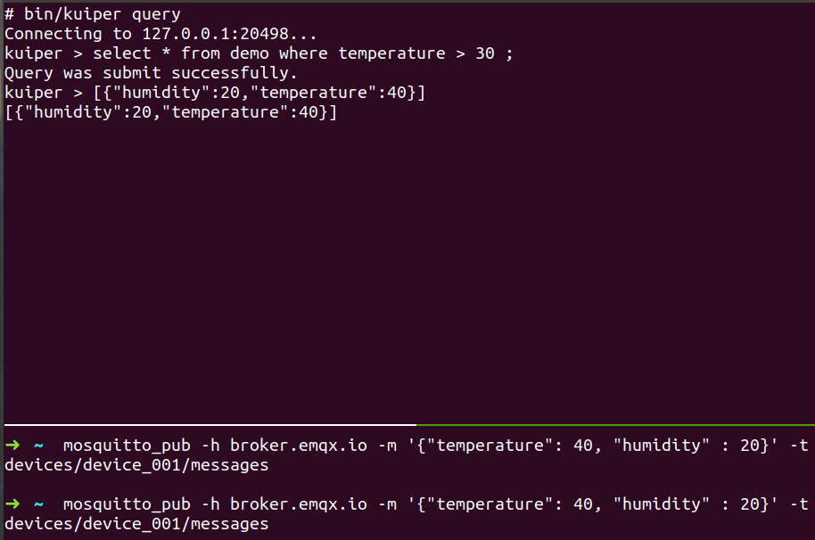

# Kuiper

Kuiper is a promising tool intented to replace Spark or Flik for the Edge.
"Written in Golang can be run at all kinds of resources".
Supports the widely-adopted operations such as Source, Trasnformation,Sink.

## Usage-Example

1. Pull docker [image](https://hub.docker.com/r/lfedge/ekuiper/tags)

2. Set Kuiper source to an MQTT sercer. For this example a public MQTT 
server hosted by EMQ.
```bash
docker run -p 9081:9081 -d --name kuiper -e
MQTT_SOURCE__DEFAULT__SERVERS=[tcp://broker.emqx.io:1883] lfedge/ekuiper:$tag
```
3. Next, operations resembling Kafka-topic creation take place.
Stream(topic) will receive the data from the MQTT server that 
Kuiper listens to.
  

```bash
-- In host
# docker exec -it kuiper /bin/sh

-- In docker instance
# bin/kuiper create stream demo '(temperature float, humidity bigint) WITH
(FORMAT="JSON", DATASOURCE="devices/+/messages")'
Connecting to 127.0.0.1:20498...
Stream demo is created.

# bin/kuiper query
Connecting to 127.0.0.1:20498...
kuiper > select * from demo where temperature > 30;
Query was submit successfully.
```
By executing this instructions, a Stream Schema is created and a query is
executed in order to collect humidity and tempratrue data.

4. Next use an MQTT client to publish data 

```bash
  # mosquitto_pub -h broker.emqx.io -m '{"temperature": 40, "humidity" : 20}' -t
devices/device_001/messages

    ```
5. TADAAAAAAA


 
